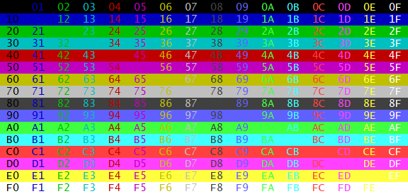

# minicle v2.1.3


Minicle is a small helper library for CLI Node programs. Its main purpose is to
parse commandline arguments -- including Git-style subcommands -- with a minimum
of fuss and a maximum of flexibility. There are certainly a few edge cases it does
not handle, but it should be adequate for the vast majority of programs.

Other features are mainly cosmetic conveniences:

- Runtime header output
- Convenient BBS-style markup for ANSI colors
- A generic but colorful error message template

## Table of Contents

- [Command line argument parsing](#cliparsing)
- [Colored text and other fluff](#fluff)
- [Function reference](#funcref)
    - [ansiMarkup](#ansimarkup_formal)
    - [ansiSubstr](#ansisubstr_formal)
    - [errmsg](#errmsg_formal)
    - [outputHeader](#outputheader_formal)
    - [paragraphize](#paragraphize_formal)
    - [parseCliArgs](#parsecliargs_formal)
    - [plainLength](#plainLength_formal)
    - [textBox](#textbox_formal)
    - [textLine](#textline_formal)
- [License](#license)
<!-- - [Todo](#todo) -->
- [Changelog](#changelog)


## Command line argument parsing <a name="cliparsing"></a>

There are scads of CLI argument processors out there, so why another one? Mostly
because the others aim to do too much and can be a pain to use when you just
need something quick and simple, or worse, when you need to do something
complicated that the original programmer didn't anticipate. All `parseCliArgs`
does is parse CLI options. It doesn't handle exotic edge cases, validate
arguments, or anything else.

What it does:

- Git-style subcommands
- Short (`-h`) and long (`--help`) options
- Optional limited number of arguments per option
- Flags/switches implemented by limiting an option's argument count to zero
- Clustering of short options, e.g. `-abc` instead of `-a -b -c`
- GNU-style double-dash (`--`) to indicate the end of options

Let's take a simple case, a program that takes three options: a flag that takes
no arguments, an option that takes up to two arguments, and a number of general
arguments not attached to an option.

```javascript
const minicle = require("minicle");

var options = {
    switches: {
        able:  { short: "a", maxArgs: 0 },  // flag, takes no args
        baker: { short: "b", maxArgs: 2 },  // has up to 2 args
    }
};

var result = minicle.parseCliArgs(process.argv.slice(2), options);
```

And that's it. The `switches` element contains the long options as keys, and
the values contain the equivalent short options and, optionally, the maximum
number of arguments they accept. One important thing to note here is that,
unlike the 1.x.x versions, you have to explicitly pass the argument array to
`parseCliArgs`, which is usually `process.argv.slice(2)`.

Then if you run the program

```bash
./myprog.js -a --baker foo bar baz quux
```

you get this back:

```javascript
{
  command: null,
  switches: {
    able: { cnt: 1, args: [] },
    baker: { cnt: 1, args: [ 'foo', 'bar' ] }
  },
  errcode: null,
  errmsg: null,
  general: [ 'baz', 'quux' ]
}
```

Since there were no errors and we're not using subcommands yet, all we care
about here are the `switches` and `general` elements. Each switch is identified
by its long name and the associated value contains a `cnt` element indicating
how many times it appeared, and an `args` element which is an array containing
any arguments that were passed along with it.

Because we configured `baker` to accept two arguments at most, `foo` and `bar`
in this case, the remaining arguments all get dumped into the `general` array.

Now if we want to get a little more complicated and use git-style subcommands,
we just add the command names into the options object as an array named `commands`,
and put the command names and their associated switches into the `switches`
object:

```javascript
{
    commands: [ "first", "second" ],
    switches: {
        first: {
            able:  { short: "a", maxArgs: 0 },
            baker: { short: "b", maxArgs: 2 },
        },
        second: {
            charlie: { short: "c", maxArgs: 1 },
            delta:   { short: "d", maxArgs: 3 },
        }
    }
}
```

Now we can type something like

```javascript
./myprog.js second --charlie foo -d bar baz quux
```

and end up with this:

```javascript
{
  command: 'second',
  switches: {
    charlie: { cnt: 1, args: [ 'foo' ] },
    delta: { cnt: 1, args: [ 'bar', 'baz', 'quux' ] }
  },
  errcode: null,
  errmsg: null,
  general: []
}
```

## Colored text and other fluff <a name="fluff"></a>

The rest Minicle are functions to handle terminal text, mostly with gratuitous
ANSI colors. Some quick examples:

The `errmsg` function produces colored error messages. It has its own default
set of error levels -- `fatal`, `warn`, `info`, and `debug` -- and associated
colors, but you can substitute your own.


The `ansiMarkup` function simulates the ancient DOS-era BBS color codes as a
more convenient way of apply ANSI colors without a bunch of separate, nested
function calls. There are also convenience functions like `ansiSubstr` for
manipulating strings with embedded color codes.



There are also a number of functions for manipulating fixed-pitch type. This has
relatively little use on the web, but can be helpful for console output and code
generation. All of them can handle embedded color codes as well.


## Function Reference <a name="funcref"></a>

### `ansiMarkup(text)` <a name="ansimarkup_formal"></a>

Patterned loosely after the ANSI markup codes from the venerable Wildcat BBS
from the DOS era, `ansiMarkup()` takes some text and applies ANSI color codes to
it, returning the results. Markup consists of a two-digit hexadecimal number
bracketed by at-signs, e.g., `@0C@` is bright red text on a black background.
The first digit encodes the background color and the second the foreground. The
values for both are as follows:

|Code|Color                              |
|----|-----------------------------------|
| 0  | Black                             |
| 1  | Blue                              |
| 2  | Green                             |
| 3  | Cyan                              |
| 4  | Red                               |
| 5  | Magenta                           |
| 6  | Yellow/brown                      |
| 7  | White                             |
| 8  | Bright black (grey)               |
| 9  | Bright blue                       |
| A  | Bright green                      |
| B  | Bright cyan                       |
| C  | Bright red                        |
| D  | Bright magenta                    |
| E  | Bright yellow                     |
| F  | Bright white                      |
| X  | no change from the previous code. |

For example

```javascript
console.log(
    minicle.ansiMarkup("This text features both @0B@foreground@07@ and @2E@background@07@ colors.")
);
```

will produce


---

### `ansiSubstr(text, offset, length)` <a name="ansisubstr_formal"></a>

Essentially the same as `String.substr`, except that it knows about `ansiMarkup`
codes and handles them gracefully. Takes `text` and returns the substring
starting at `offset` and running for `length` characters with all color codes
intact.

---

### `errmsg(level, message, location = null, options = { })` <a name="errmsg_formal"></a>

Outputs a colorful error message if `level` is equal to or less than `options.verbosity` which
takes the form

```
    [level] message (location)
```

If `location` is `null`, it will be omitted from output. By default, output is
via `console.log`, but another function may be substituted by setting
`options.output`.

Also by default, there are four error levels named `"fatal"`, `"warn"`,
`"info"`, and `"debug"`, and if `"fatal"` is given, the program will terminate
by calling `process.exit(1)`. To alter or replace the defaults, pass your own
definitions in `options.levels`. The defaults look like this:

```javascript
const errorLevels = [
    { name: "fatal", levelColor: "@CE@", messageColor: "@CF@", locationColor: "@0E@", quit: true },
    { name: "warn",  levelColor: "@E0@", messageColor: "@0E@", locationColor: "@06@", quit: false },
    { name: "info",  levelColor: "@2F@", messageColor: "@0A@", locationColor: "@02@", quit: false },
    { name: "debug", levelColor: "@8F@", messageColor: "@07@", locationColor: "@0F@", quit: false },
];
```

The various colors are specified using the color codes from `ansiMarkup`.

---

### `outputHeader(text, style, boxColor, width)` <a name="outputheader_formal"></a>

This is a simplified high-level wrapper around `textBox` for the special case of
generating a colorful one-line text box to serve as a header for the output of a
command line program.

| argument | description                                                                                                                                                  |
|----------|--------------------------------------------------------------------------------------------------------------------------------------------------------------|
| text     | The text to be displayed, which may include ANSI markup codes. This must be a single line, and will be truncated if necessary to fit within the box `width`. |
| style    | One of `"basic"`, `"ascii"`, `"pcdos1"`, or `"pcdos2"`                                                                                                       |
| boxColor | The ANSI markup code to apply to the box outline, or `null` if none.                                                                                         |
| width    | The width of the box, including the box outline. Defaults to `76`.                                                                                           |

The result is automatically sent to `console.log()`. For example

```javascript
minicle.outputHeader("@0E@MyProg v1.2.0@07@ -- @0B@Processing for something made easy@07@", "pcdos2", "@0C@");
```

will produce


---

### `paragraphize(text, options = { })` <a name="paragraphize_formal"></a>

Takes a string and wraps and aligns it, returning the result as an array of
lines.

| option           | description                                                                                           |
|------------------|-------------------------------------------------------------------------------------------------------|
| width            | The width of the paragraph. Defaults is '76'.                                                         |
| indent           | Number of characters to indent the first line. Default is '0'.                                        |
| align            | May be `"left"`, `"right"`, `"center"`, or `"full"`, and defaults to `"left"`.                        |
| ignoreAnsiMarkup | If `true`, ignore ANSI markup so that line lengths are unaffected. Default is `false`.                |
| join             | If `true`, return a string with embedded newlines instead of an array of strings. Default is `false`. |

The four `align` settings appear thus with a `width` of `32`:

```
LEFT: This is a short sample
paragraph, intended for use in
the documentation of Minicle.
It's just long enough to
demonstrate the paragraphize
method.

   RIGHT: This is a short sample
  paragraph, intended for use in
   the documentation of Minicle.
        It's just long enough to
    demonstrate the paragraphize
                         method.

 CENTER: This is a short sample
 paragraph, intended for use in
 the documentation of Minicle.
    It's just long enough to
  demonstrate the paragraphize
            method.

FULL:  This  is  a  short sample
paragraph,  intended  for use in
the  documentation  of  Minicle.
It's   just   long   enough   to
demonstrate   the   paragraphize
method.
```

---

### `parseCliArgs(args, options)` <a name="parsecliargs_formal"></a>

Takes an input array, `args`, which is usually `process.argv.slice(2)`, and an
`options` object specifying the command line switches and optional subcommands
to be parsed. Returns either an object containing the parsed results or an
object containing `errcode` and `errmsg` elements.

The `options` argument takes one of two forms, depending on whether subcommands
are being used. Without subcommands:

```javascript
{
    switches: {
        able:  { short: "a", maxArgs: 0 },  // flag, takes no args
        baker: { short: "b", maxArgs: 2 },  // has up to 2 args
    },
    ddash: true
}
```

The optional `ddash` element, if `true`, will cause a GNU-style double dash `--`
to end processing of switches, resulting in all subsequent arguments being
treated as literals.

If subcommands are desired, they are specified in a `commands` element, and the
`switches` element will contain objects with switches for each subcommand:

```javascript
{
    commands: [ "first", "second" ],
    switches: {
        first: {
            able:  { short: "a", maxArgs: 0 },
            baker: { short: "b", maxArgs: 2 },
        },
        second: {
            charlie: { short: "c", maxArgs: 1 },
            delta:   { short: "d", maxArgs: 3 },
        }
    }
}
```

On error, an object will be returned containing an error code and an error
message:

```javascript
{ errcode: "BADLONG", errmsg: "Invalid long option '--foo'." }
```

The `errcode` is guaranteed to remain unchanged across future versions of
Minicle so user code can rely on it. The `errmsg` is mainly intended to help
with debugging, though it is suitable for display to end users.

On success, a structure like this is returned for simple switches:

```javascript
{
  command: null,
  switches: {
    alpha: { cnt: 1, args: [ 'foo', 'bar' ] },
    beta: { cnt: 1, args: [] },
    charlie: { cnt: 0, args: [] }
  },
  errcode: null,
  errmsg: null,
  general: []
}
```

The only difference for git-style commands is that the `command` element
will not be `null`.

---

### `plainLength(text)` <a name="plainlength_formal"></a>

A convenience function used internally, takes `text` and returns its
length minus any of the codes used by `ansiMarkup`.

---

### `textBox(text, style, opts)` <a name="textbox_formal"></a>

Generates a box around a block of `text`. The `style` argument is an array of
eight strings specifying the appearance of corners and sides in clockwise order
starting with the top left corner. Alternatively, a few named styles are built
in: `"basic"`, `"ascii"`, `"pcdos1"`, `"pcdos2"`. (Minicle also exports an
object named `extraStyles` which contains additional named styles, but you must
pass the value instead of the key when using them.) The `options` argument may
contain one or more of the following:

| option           |description                                                                                                                                                                                                         |
|------------------|--------------------------------------------------------------------------------------------------------------------------------------------------------------------------------------------------------------------|
| width            | Total width of box, sides inclusive. Defaults to `76`.                                                                                                                                                             |
| reflow           | If `true`, all contiguous blocks of text are rewrapped to fit within the box. Lines beginning with whitespace are not modified and may cause overflow on the right. Blank lines are unaltered. Defaults to `false`.|
| noRight          | If `true`, omit the right side of the box. Defaults to `false`.                                                                                                                                                    |
| ignoreAnsiMarkup | If true, expect the style to contain `ansiMarkup` codes and exclude them from character length calculations. Defaults to `false`.                                                                                  |
| padding          | An array of character cell counts, [ _top_, _right_, _bottom_, _left_ ] to use for padding. Defaults to `[0, 1, 0, 1]`.                                                                                            |

The result is returned as an array of lines.

For example

```javascript
console.log(minicle.textBox("basic style",  "basic",  { width: 20 }).join("\n") + "\n");
console.log(minicle.textBox("ascii style",  "ascii",  { width: 20 }).join("\n") + "\n");
console.log(minicle.textBox("pcdos1 style", "pcdos1", { width: 20 }).join("\n") + "\n");
console.log(minicle.textBox("pcdos2 style", "pcdos2", { width: 20 }).join("\n") + "\n");
```

will yield


As a guide to designing your own styles, here is how the built-in styles are defined:

```javascript
const styles = {
    //         0    1    2    3    4    5    6    7        0 1 2     TL TC TR
    //        TL   TC   TR    R   BR   BC   BL    L        7   3     ML    MR
    basic:  [ "=", "=", "=", "=", "=", "=", "=", "=" ], // 6 5 4     BL BC BR
    ascii:  [ "+", "-", "+", "|", "+", "-", "+", "|" ],
    pcdos1: [ "┌", "─", "┐", "│", "┘", "─", "└", "│" ],
    pcdos2: [ "╔", "═", "╗", "║", "╝", "═", "╚", "║" ],
};
```

Minicle also exports an object named `extraStyles` which contains additional
named styles, but you must pass the value instead of the key when using them:

```javascript
var lines = minicle.textBox("extra example", minicle.extraStyles.lcAsciiGap, { width: 20 })
```

At present (version 2.1.0), these are all for generating comment blocks in C-like languages:


---

### `textLine(width = 76, style = "basic", ignoreAnsiMarkup = false)` <a name="textline_formal"></a>

Emits a single line of the specified style. The `style` argument follows the
same format as in `textBox`, but only the first three elements are used. If
`ignoreAnsiMarkup` is `true`, embedded `ansiMarkup` codes will be ignored when
performing character length calculations.


## License <a name="license"></a>

Copyright 2019-2023 Eric O'Dell and subsequent contributors

Redistribution and use in source and binary forms, with or without modification,
are permitted provided that the following conditions are met:

1. Redistributions of source code must retain the above copyright notice, this
list of conditions and the following disclaimer.

2. Redistributions in binary form must reproduce the above copyright notice,
this list of conditions and the following disclaimer in the documentation and/or
other materials provided with the distribution.

THIS SOFTWARE IS PROVIDED BY THE COPYRIGHT HOLDERS AND CONTRIBUTORS "AS IS" AND
ANY EXPRESS OR IMPLIED WARRANTIES, INCLUDING, BUT NOT LIMITED TO, THE IMPLIED
WARRANTIES OF MERCHANTABILITY AND FITNESS FOR A PARTICULAR PURPOSE ARE
DISCLAIMED. IN NO EVENT SHALL THE COPYRIGHT HOLDER OR CONTRIBUTORS BE LIABLE FOR
ANY DIRECT, INDIRECT, INCIDENTAL, SPECIAL, EXEMPLARY, OR CONSEQUENTIAL DAMAGES
(INCLUDING, BUT NOT LIMITED TO, PROCUREMENT OF SUBSTITUTE GOODS OR SERVICES;
LOSS OF USE, DATA, OR PROFITS; OR BUSINESS INTERRUPTION) HOWEVER CAUSED AND ON
ANY THEORY OF LIABILITY, WHETHER IN CONTRACT, STRICT LIABILITY, OR TORT
(INCLUDING NEGLIGENCE OR OTHERWISE) ARISING IN ANY WAY OUT OF THE USE OF THIS
SOFTWARE, EVEN IF ADVISED OF THE POSSIBILITY OF SUCH DAMAGE.

<!-- <a name="todo"></a>
## Todo
* Fixed-format display utilities ???
* Filename wildcard support
* C version
-->

<a name="changelog"></a>
## Changelog

2.1.2: Bumped version number.

2.1.1: Added graphical representations of ASCII art that the NPM Markdown renderer was messing up.

2.1.0:

* Added `outputHeader` as a convenience function for usage headers.
* Added more examples in the documentation.
* Fixed missing graphics in documentation.

2.0.0:

The format of the option map has been greatly simplified along with the
underlying code with no loss of functionality. Exceptions have been replaced
with simple error codes. The `usage()` function has been eliminated and replaced
with a generic ANSI markup language interpreter.

* Removed exceptions triggered by end-user error and instead return error objects.
* Merged `minicle-usage` into the main Minicle module.
* Eliminated '@' in map receptacle entries so they can be used without brackets in the code.
* Filled in missing documentation on the `customColors` option to the `headers` method.

1.0.6: Updated the docs to announce minicle-usage.

1.0.5: Added `doubleDash` option, improved docs, tested heavily, fixed a bunch of edge cases.

1.0.4: Added `@subcommand` to `optionMap` results, documented same.

1.0.3: We don't talk about this anymore.

1.0.2: Fixed bug that threw an uncaught exception when no CLI arguments were given.

1.0.1: Updated docs to include the necessary options for subcommands.

